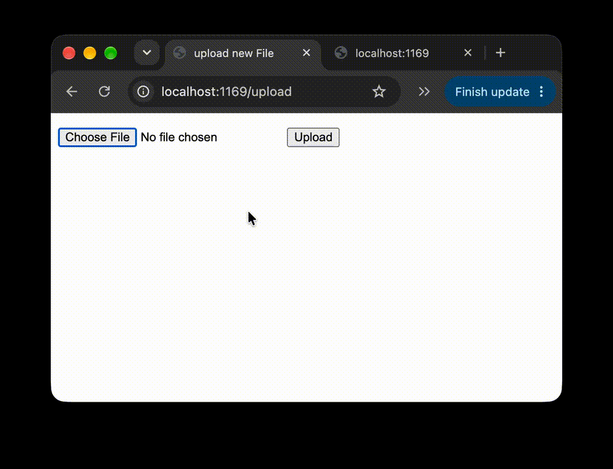

# Flask on Docker

[](https://github.com/James-Zhu1/flask-on-docker/actions/workflows/build.yml)


A production-ready Flask web service, fully containerized with Docker Compose, backed by PostgreSQL, and served through Gunicorn behind an Nginx reverse proxy.

---

## Overview

This repository packages a Flask application and its PostgreSQL database into a reproducible, multi-container environment with separate development and production configurations. In development, the Flask dev server runs with hot reloading against a Postgres container, and an entrypoint script waits for the database to become healthy before initializing the schema. In production, a multi-stage Docker build compiles dependencies into wheels and installs them into a slim, non-root image; Gunicorn serves the WSGI app on an internal-only port, and Nginx sits in front of it as a reverse proxy, serving static assets and user-uploaded media directly from shared volumes so the application server never handles file I/O. The app exposes a JSON health route, a static-file route, an HTML upload form, and a media-retrieval route. Credentials are never committed: every environment file is git-ignored and documented by a committed `.example` template, and every push to `main` is built and smoke-tested end to end by GitHub Actions.

### Demo

Running the dev stack, uploading an image through `/upload`, and retrieving it from `/media/<filename>`:



---

## Architecture

```
                 ┌──────────────────────────────────────────────┐
                 │               docker compose                 │
                 │                                              │
  :1169 ──────►  │  nginx  ──────►  web (gunicorn :5000)  ──►  db (postgres :5432)
                 │    │                   │                     │
                 │    └── static_volume ──┘                     │
                 │    └── media_volume  ──┘                     │
                 └──────────────────────────────────────────────┘
```

| Service | Image | Role |
|---|---|---|
| `web` | `python:3.11-slim` (custom) | Flask app via Gunicorn (prod) or dev server (dev) |
| `db` | `postgres:13` | Persistent relational store |
| `nginx` | `nginx:1.25` (custom, prod only) | Reverse proxy; serves `/static/` and `/media/` |

In development, `web` is published directly on host port 1169. In production, only `nginx` is published on 1169 and `web` is reachable solely on the internal Docker network.

## Tech Stack

- **Flask 2.3** with **Flask-SQLAlchemy** and **psycopg2**
- **PostgreSQL 13**
- **Gunicorn** WSGI server
- **Nginx 1.25** reverse proxy
- **Docker** multi-stage builds, **Docker Compose** orchestration
- **GitHub Actions** CI

---

## Project Structure

```
.
├── .github/workflows/build.yml   # CI: build + smoke-test dev stack
├── docker-compose.yml            # development
├── docker-compose.prod.yml       # production
├── .env.dev.example              # templates — copy to .env.* and fill in
├── .env.prod.example
├── .env.prod.db.example
├── .gitignore                    # ignores .env.*, venvs, uploaded media
├── docs/demo.gif
└── services
    ├── nginx
    │   ├── Dockerfile
    │   └── nginx.conf
    └── web
        ├── Dockerfile            # dev image
        ├── Dockerfile.prod       # multi-stage prod image, non-root user
        ├── entrypoint.sh         # wait for DB, create tables (dev)
        ├── entrypoint.prod.sh    # wait for DB only (prod)
        ├── manage.py             # Flask CLI: run, create_db, seed_db
        ├── requirements.txt
        └── project
            ├── __init__.py       # app, routes, User model
            ├── config.py
            ├── static/
            └── media/            # uploads land here (git-ignored)
```

---

## Build Instructions

### Prerequisites

- [Docker Desktop](https://docs.docker.com/get-docker/) 20.10+ (includes Docker Compose v2)
- Git

> Commands below use `docker compose` (v2). If you have the legacy standalone binary, substitute `docker-compose`.

### 1. Clone

```bash
git clone https://github.com/James-Zhu1/flask-on-docker.git
cd flask-on-docker
```

### 2. Environment files

Real `.env*` files are git-ignored. Copy the committed templates and replace every `PLACEHOLDER_*` value with your own:

```bash
cp .env.dev.example     .env.dev
cp .env.prod.example    .env.prod
cp .env.prod.db.example .env.prod.db
```

Or fill them in from the command line (pick your own values):

```bash
sed -e 's/PLACEHOLDER_USER/myuser/g' \
    -e 's/PLACEHOLDER_PASSWORD/mypassword/g' \
    -e 's/PLACEHOLDER_DB_NAME/hello_flask_dev/g' \
    .env.dev.example > .env.dev
```

| File | Used by | What to set |
|---|---|---|
| `.env.dev` | `web` and `db` (dev) | `POSTGRES_USER`, `POSTGRES_PASSWORD`, `POSTGRES_DB`, and the matching `DATABASE_URL` |
| `.env.prod` | `web` (prod) | `DATABASE_URL` with your prod credentials |
| `.env.prod.db` | `db` (prod) | `POSTGRES_USER`, `POSTGRES_PASSWORD`, `POSTGRES_DB` — must match `.env.prod` |

The user, password and database name inside `DATABASE_URL` must be identical to the `POSTGRES_*` values that initialize the container, otherwise the app cannot connect.

### 3a. Run in development

```bash
docker compose up -d --build
```

The `web` container waits for Postgres, drops and recreates the tables, then starts the Flask dev server with live reload. Source is bind-mounted, so edits apply immediately.

| URL | What you should see |
|---|---|
| http://localhost:1169/ | `{"hello": "world"}` |
| http://localhost:1169/static/hello.txt | `hi!` |
| http://localhost:1169/upload | HTML upload form |
| http://localhost:1169/media/ `<filename>` | the file you uploaded |

Optional — insert a sample user and inspect the database (substitute your own user/db name):

```bash
docker compose exec web python manage.py seed_db
docker compose exec db psql --username=myuser --dbname=hello_flask_dev -c "select * from users;"
```

Stop and remove containers and volumes:

```bash
docker compose down -v
```

### 3b. Run in production mode

Make sure the dev stack is down first — both configurations publish port 1169.

```bash
docker compose -f docker-compose.prod.yml up -d --build
docker compose -f docker-compose.prod.yml exec web python manage.py create_db
```

Gunicorn listens only on the internal Docker network; Nginx is the single public entry point.

| URL | Served by |
|---|---|
| http://localhost:1169/ | Nginx → Gunicorn → Flask |
| http://localhost:1169/static/hello.txt | Nginx directly (`static_volume`) |
| http://localhost:1169/upload | Nginx → Gunicorn → Flask |
| http://localhost:1169/media/ `<filename>` | Nginx directly (`media_volume`) |

Tear down:

```bash
docker compose -f docker-compose.prod.yml down -v
```

### Useful commands

| Command | Purpose |
|---|---|
| `docker compose logs -f` | Follow logs (add `-f docker-compose.prod.yml` for prod) |
| `docker compose exec web python manage.py create_db` | Drop and recreate all tables |
| `docker compose exec web python manage.py seed_db` | Insert a sample `User` row |
| `docker compose ps` | Show running services |
| `docker volume inspect flask-on-docker_postgres_data` | Inspect the persistent DB volume |

---

## Continuous Integration

The [`build.yml`](.github/workflows/build.yml) workflow runs on every push and pull request to `main`. It generates a `.env.dev` from `.env.dev.example` using throwaway CI-only credentials, builds the development images, starts the stack, waits until `http://localhost:1169/` responds, and tears everything down. No real secrets are stored in the repository or in GitHub.

---

## Troubleshooting

| Symptom | Fix |
|---|---|
| `FATAL: database "..." does not exist` or password authentication failed | Stale volume from a previous run with different credentials. Run `docker compose down -v`, then rebuild. |
| `PLACEHOLDER_USER` appears in an error | You copied an `.example` file without filling it in. |
| `permission denied: entrypoint.sh` | `chmod +x services/web/entrypoint.sh services/web/entrypoint.prod.sh` |
| Port 1169 already in use | Stop the other stack (`docker compose down` / `-f docker-compose.prod.yml down`), or change the host port in the compose file. |
| Container exits immediately | `docker compose logs web` |

---

## Acknowledgements

Based on the TestDriven.io tutorial [*Dockerizing Flask with Postgres, Gunicorn, and Nginx*](https://testdriven.io/blog/dockerizing-flask-with-postgres-gunicorn-and-nginx/) by Michael Herman.
